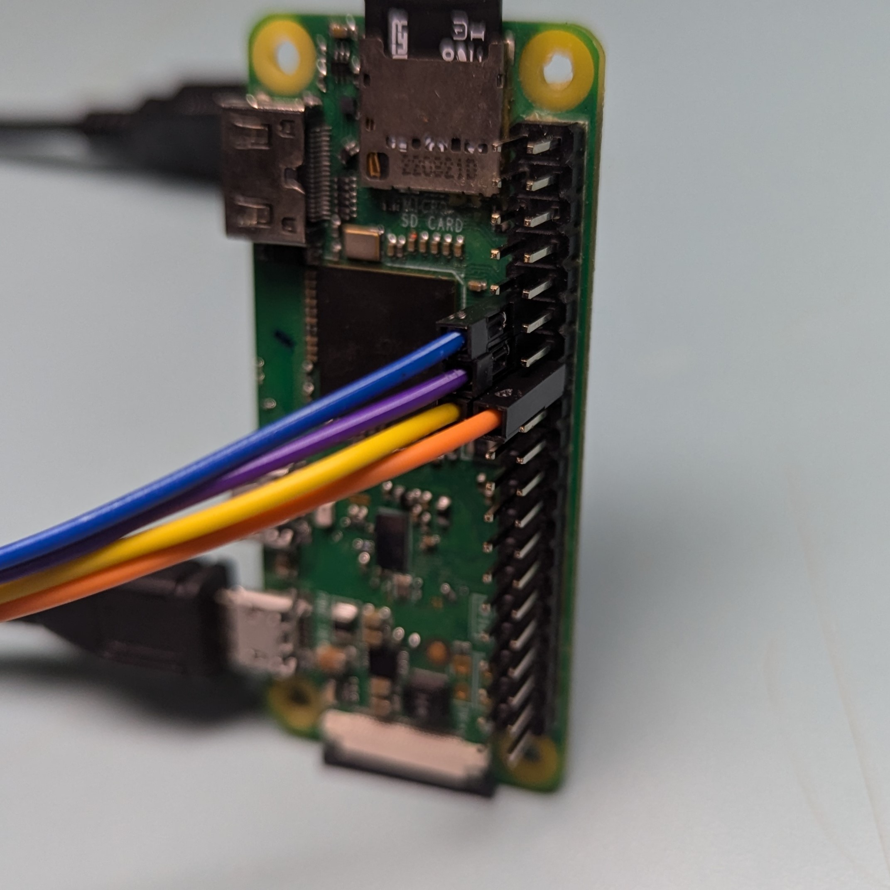

# Stepper Motor Demo

## About

### Description

This project was orginially conceived to show a group of friends how a stepper motor works.

Recently, I have incorporated it into my "Disco Ball" 3D printing project. I hope to make a printable disco ball and use a stepper motor to spin it. I'll update this readme once the project is printed and complete.

### Quick Video

[**Click here for <1 minute introduction**](https://youtube.com/shorts/1uA7yoVe8u4)

## Assembly

### Parts List

| Part                   | Link                                                                                                                                                                                                                                                                                                                                                                                                                                                                                                                                                                                       |
| ---------------------- | ------------------------------------------------------------------------------------------------------------------------------------------------------------------------------------------------------------------------------------------------------------------------------------------------------------------------------------------------------------------------------------------------------------------------------------------------------------------------------------------------------------------------------------------------------------------------------------------ |
| Raspberry Pi Zero 2 W  | [Micro Center](https://www.microcenter.com/product/643085/raspberry-pi-zero-2-w)                                                                                                                                                                                                                                                                                                                                                                                                                                                                                                           |
| Stepper Motor 28BYJ-48 | [Amazon](https://www.amazon.com/SYUAB-28BYJ-48-ULN2003-Stepper-Raspberry/dp/B09MRTD2SZ/ref=sr_1_2_sspa?crid=2311CL4SJKV6D&dib=eyJ2IjoiMSJ9.09ZVIWXs04-XFKBqoVxXMisEjyndr2kuRbQ5r9dre7tdhwyQkQ9aUvC7CDtbLrU05rEMOL5mxo0oxqkEoPnIKbtuRVM4opDRMmNJGMbxFOD6kfu42OxyIYzypXJcSt5nvJ7I_kHVbmZnZsl29Wb9V0Hb9Lbqt_Zdn51jdGTyi-IYQJswhHcJTbcGuFdpxBQPTB96p94AHvrGKMvhUMfd7I5X8pWHTlCsepW5jOYdTtc.KVsYTlaNP8yzynkXTIgXyJYxVdw7qL_P_VsGYfj1n_E&dib_tag=se&keywords=stepper+motor+28byj+48&qid=1726029497&sprefix=stepper+motor+28byj+48%2Caps%2C158&sr=8-2-spons&sp_csd=d2lkZ2V0TmFtZT1zcF9hdGY&psc=1) |
| Motor Control Board    | [Amazon](https://www.amazon.com/SYUAB-28BYJ-48-ULN2003-Stepper-Raspberry/dp/B09MRTD2SZ/ref=sr_1_2_sspa?crid=2311CL4SJKV6D&dib=eyJ2IjoiMSJ9.09ZVIWXs04-XFKBqoVxXMisEjyndr2kuRbQ5r9dre7tdhwyQkQ9aUvC7CDtbLrU05rEMOL5mxo0oxqkEoPnIKbtuRVM4opDRMmNJGMbxFOD6kfu42OxyIYzypXJcSt5nvJ7I_kHVbmZnZsl29Wb9V0Hb9Lbqt_Zdn51jdGTyi-IYQJswhHcJTbcGuFdpxBQPTB96p94AHvrGKMvhUMfd7I5X8pWHTlCsepW5jOYdTtc.KVsYTlaNP8yzynkXTIgXyJYxVdw7qL_P_VsGYfj1n_E&dib_tag=se&keywords=stepper+motor+28byj+48&qid=1726029497&sprefix=stepper+motor+28byj+48%2Caps%2C158&sr=8-2-spons&sp_csd=d2lkZ2V0TmFtZT1zcF9hdGY&psc=1) |
| DuPont Wires (F-F)     | [Amazon](https://www.amazon.com/Multicolored-Breadboard-Raspberry-120-Wires/dp/B0D56T3KQ8/ref=sr_1_1_sspa?crid=2UHHEISZNYIFO&dib=eyJ2IjoiMSJ9.lELC5-gncdYu6G9BRLhOdCHZ162tO6_pDczMCIn5t6BMvW06Nb1z_CeoJXYjxmhOOZoBBrU_RBUOIWk6unPrHAok3H5q5Sy9GAX0_4iLQX2Ml-7dWbPDY3Z4gA0OqgkAtIvwthzQwGfLOxqsO4sfjuSD0EpxOebhx5XI2el_GwMTEQYbxEEFZ3Fo9C2l8Z8xFjPeEukGDe8rLFQk0HVRRw_pY8q7O9Q57tFGgWWWCYk.BTeUj5FxWIs4m9FvSrwzoelVv8rc9Oc1HON6YNUqT-0&dib_tag=se&keywords=dupont+wire&qid=1726029521&sprefix=dupont%2Caps%2C221&sr=8-1-spons&sp_csd=d2lkZ2V0TmFtZT1zcF9hdGY&psc=1)                         |

### Connections

| Pi Pin (BCM) | Motor Board Pin |
| ------------ | --------------- |
| 17           | IN1             |
| 27           | IN2             |
| 22           | IN3             |
| 23           | IN4             |

**Match colors of wires to respective pins on devices.**




**The motor should have a fitted connector going to the board.**


**WARNING: YOU MUST POWER THE MOTOR INDEPENDENTLY! _DO NOT POWER THE MOTOR DIRECTLY FROM THE RASPBERRY PI_**
**I recommend using a USB connection.**


### Running the Program

1. Set up your Rapsberry Pi. There are instructions here: [Set up Raspberry Pi](https://github.com/DavidMiles1925/pi_zero_setup#setting-up-raspberry-pi-zero)

2. Install the code

**NOTE:** Ensure git is installed on your Raspberry Pi, see the link from the above step.

```bash
git clone https://github.com/DavidMiles1925/stepper_motor_demo.git
```

3. (Optional) Set the program up to run on startup.

- Edit the `rc.local` file:

```bash
sudo nano /etc/rc.local
```

- Add this line to the file, right before the `exit 0`. Make sure to replace `YOUR_PI_NAME` with the actual name of your Pi.

```bash
sudo python /home/YOUR_PI_NAME/stepper_motor_demo/motor.py &
```

## Controlling the Motor

**To change the behavior of the motor, your must edit these values in the code of `motor.py`.**

### `number_of_turns`

This is an integer that determines how many times the motor will turn. The default value is very high to create an illusion of "infinite" spinning.

Default Value = 10000

### `step_direction`

This is a boolean value (either `True` or `False`).

Default Value = `True`

| Value   | Rotation          |
| ------- | ----------------- |
| `True`  | Clockwise         |
| `False` | Counter-Clockwise |

### `step_delay`

This value controls the speed of the motor.

The formula for determining this value is as follows:  
DELAY = (60/RPM) / 4096

These are some quick-values for the `step_delay` value.

Default Value = 0.014648 (1 RPM)

| Speed   | Value    |
| ------- | -------- |
| 1/2 RPM | 0.029297 |
| 1 RPM   | 0.014648 |
| 2 RPM   | 0.007324 |
| 5 RPM   | 0.002930 |
| 10 RPM  | 0.001465 |
| 15 RPM  | 0.000977 |
| 20 RPM  | 0.000732 |

**WARNING: DO NOT EXCEED 20 RPM. THE MOTOR WILL PRODUCE TOO MUCH HEAT AND EVENTUALLY FAIL.**
